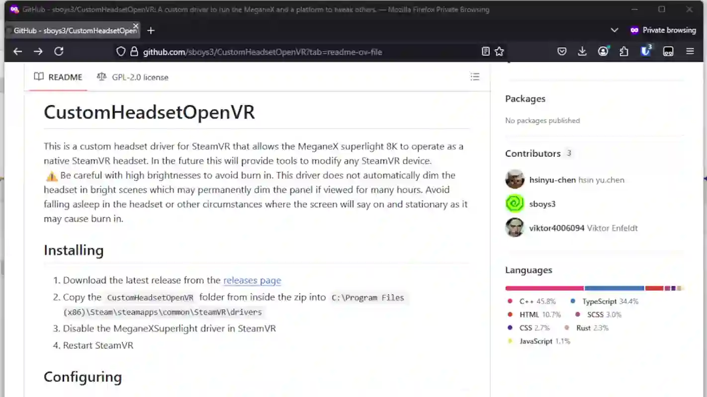

# CustomHeadsetOpenVR
This is a custom headset driver for SteamVR that allows the MeganeX superlight 8K to operate as a native SteamVR headset. In the future this will provide tools to modify any SteamVR device.  
⚠️Be careful with high brightnesses to avoid burn in on the MeganeX. This driver does not automatically dim the headset in bright scenes which may permanently dim the panel if viewed for many hours.

<picture></picture>

## Installing
1. Download the latest release from the [releases page](https://github.com/sboys3/CustomHeadsetOpenVR/releases/latest)
2. Extract the whole folder within the zip to a place you want it.
3. Run `custom-headset-gui.exe` in `CustomHeadsetGUI` to finish the installation and configure settings.

Manual Driver Installation

You do not need to do this if you installed the driver with the GUI.

1. Copy the `CustomHeadsetOpenVR` folder from inside the zip into `C:\Program Files (x86)\Steam\steamapps\common\SteamVR\drivers` 
2. Disable the MeganeXSuperlight driver in SteamVR
3. Restart SteamVR

## Updating
1. Download the latest release from the [releases page](https://github.com/sboys3/CustomHeadsetOpenVR/releases/latest)
2. Extract the whole folder within the zip to a place you want it.
3. Run `custom-headset-gui.exe` in `CustomHeadsetGUI`
4. Go to the about page and install the new driver.

## Configuring
Run `custom-headset-gui.exe` to configure settings.
Almost all settings will be immediately applied when the file is saved without restarting SteamVR.  
### Manual Configuration
Enter `%APPDATA%/CustomHeadset` into the file browser top bar to get to the settings folder.  
Edit the `settings.json` file based on the [Config header file](./CustomHeadsetOpenVR/src/Config/Config.h)  
Distortion profiles go in a folder named `Distortion` and they are referenced by their name.  

## Building
1. Clone the repository wit `git clone https://github.com/sboys3/CustomHeadsetOpenVR.git`
2. Navigate to the repository folder with `cd CustomHeadsetOpenVR` in the terminal.
3. Pull the submodules with `git submodule update --init --recursive`
4. Open the solution in Visual Studio.
5. Change the configuration to Release.
6. Build the solution. It will create the driver folder in `output` and copy it to the SteamVR drivers folder.

To pull the latest changes, run `git pull --recurse-submodules`

## Features
- MeganeX
	- [x] Running as a native headset
	- [x] Ignore other headsets
	- [x] Code to generate the distortion mesh
	- [X] Darken the display when no motion is detected
	- [X] Support for non square outputs to light edges of the display
	- [X] A good default distortion profile
	- [ ] A near perfect default distortion profile
	- [X] Multiple distortion profiles
	- [X] Hidden area mesh
- Custom Shader
	- [X] Replace SteamVR compositor shaders at runtime
	- [X] Configure contrast, chroma, and gamma
	- [X] Subpixel shifts for the MeganeX and Vive
	- [X] sRGB color correction for the MeganeX
	- [X] Remove mura correction or black clamp for any native headset
	- [X] Support all native headsets
- Config
	- [X] Define the structure of the config file
	- [X] Create MeganeX section
	- [X] Read config file
	- [X] Hot reload when the config is changed
	- [X] Load custom distortion profiles
	- [ ] Define the structure for the overrides section
- GUI
	- [X] Create a Tauri project
	- [X] Create a Angular project within it
	- [X] Configure MeganeX settings
	- [ ] Edit distortion profiles my dragging points on a curve
	- [ ] Create overrides for any headset
	- [X] Install the driver
	- [ ] Change physical MeganeX settings
- Driver
	- [ ] Linux build support
	- [ ] Override any property of any SteamVR device based on the config
	- [ ] Change device types
	- [ ] Apply presets to devices ex: Vive tracker or generic headset
	- [ ] Output json file with information about SteamVR and devices for configuration utilities to use.

## License
This project is licensed under the GPLv2 license. See the LICENSE file for more details.
I may relicense this project for to allow for use that GPLv2 does not allow for so be aware of that when you contribute

## Contributing
By committing to this repository you give me the right to relicense your code for others to use. If you want to make a significant contribution but do not want to comply with this, mark your code as such and let me know so I will be able to remove it if I need to.

Try to keep the coding style consistent with existing files. But other than keeping tabbing consistent, I will not enforce strict guidelines.

## Supporters
Thanks to everyone who has shown appreciation to me for this project. It has been an amazing experience having so many people thank me for my work. I really appreciate the kind words you all had for me and I have a special appreciation to those who went a step further and donated.

<picture></picture> [<picture></picture>](https://github.com/gregtakacs "Greg Takacs") <picture></picture> <picture></picture> [<picture></picture>](# "GoodyearBiff") [<picture></picture>](https://hookmanuk.itch.io/ "hookman") [<picture></picture>](https://www.youtube.com/c/VRFlightSimGuy "VR Flight Sim Guy") <picture></picture> <picture></picture> <picture></picture> <picture></picture> <picture></picture> <picture></picture> <picture></picture> <picture></picture> <picture></picture> <picture></picture> <picture></picture> <picture></picture> <picture></picture> <picture></picture> <picture></picture> <picture></picture> <picture></picture> <picture></picture> <picture></picture> <picture></picture> <picture></picture> <picture></picture> <picture></picture> <picture></picture> <picture></picture> <picture></picture> [<picture></picture>](https://www.youtube.com/@Essentia-Channel "Essentia") <picture></picture> <picture></picture> <picture></picture> <picture></picture> <picture></picture> <picture></picture> <picture></picture> <picture></picture> <picture></picture> <picture></picture> <picture></picture> [<picture></picture>](# "Richard Åsberg (WebMaximus)") <picture></picture> <picture></picture> <picture></picture> <picture></picture> [<picture></picture>](https://www.artstation.com/cless "") <picture></picture> <picture></picture> [<picture></picture>](https://github.com/hsinyu-chen "hsin yu,chen") <picture></picture> <picture></picture> [<picture></picture>](# "Nick Babalis") [<picture></picture>](https://www.youtube.com/@MartydudeVR "MartydudeVR") <picture></picture> <picture></picture> <picture></picture> <picture></picture> <picture></picture> <picture></picture> [<picture></picture>](# "SparkerInVR") <picture></picture> <picture></picture> <picture></picture> <picture></picture> <picture></picture> <picture></picture> <picture></picture> <picture></picture> <picture></picture> 

If you want your info displayed, send me a message on the platform you donated on. You can tell me where to get an icon, a name to display when hovered, and a link to wherever you want. You can provide any combination of the 3 and I will add it. Alternatively you can remain autonomous as a generic icon. I can always change it for you in the future, but it will stay in github history.
